# Architecture — Time Thief

Class diagram of every custom class and its relationship to Phaser-provided ancestors.

> **Legend — method markers**
> Methods marked `[override]` are Phaser lifecycle methods that this class overrides.
> All other methods are new additions defined by the team.

```mermaid
classDiagram
    %% ─── Phaser base classes ────────────────────────────────────────────────
    class PhaserScene["Phaser.Scene"] {
        <<Phaser>>
        +init(data)
        +preload()
        +create()
        +update()
    }

    class PhaserArcadeSprite["Phaser.Physics.Arcade.Sprite"] {
        <<Phaser>>
    }

    %% ─── Audio system ────────────────────────────────────────────────────────
    class AudioManager {
        +masterVolume : number
        -ctx : AudioContext
        -bgMusic : Sound
        -musicPlaying : boolean
        +constructor(scene)
        +init()
        +resume()
        +setVolume(vol)
        +playTone(freq, duration, type, volume)
        +playJump()
        +playHit()
        +playCaught()
        +playWin()
        +playTimeSwitch()
        +startMusic()
        +playMusicLoop()
        +stopMusic()
    }

    %% ─── Game-object hierarchy ───────────────────────────────────────────────
    class GameObject {
        +period : string
        +objectType : string
        +persistentState : Object
        +constructor(scene, x, y, texture, config)
        +onPeriodChange(newPeriod)
        +isActiveInPeriod(period) bool
    }

    class Player {
        +speed : number
        +jumpForce : number
        +constructor(scene, x, y)
        +moveLeft()
        +moveRight()
        +stopMoving()
        +jump() bool
        +isMidAir$ bool
    }

    class Guard_Generic {
        +speed : number
        +jumpForce : number
        +verticalReach : number
        +chaseRange : Ellipse
        +patroling : boolean
        +cooldownTimer : TimerEvent
        +constructor(scene, x, y, visionSize, patrolRoute, timePeriod, texture)
        +moveLeft()
        +moveRight()
        +stopMoving()
        +jump() bool
        +isMidAir$ bool
        +chase(target)
        +setPatrolRoute(route)
        +patrol()
        +fixVisionRing()
    }

    class Guard_Present {
        +constructor(scene, x, y, visionLength, patrolRoute)
    }

    class Guard_Past {
        +constructor(scene, x, y, visionLength, patrolRoute)
    }

    %% ─── Scene hierarchy ─────────────────────────────────────────────────────
    class BootScene {
        +constructor() [override]
        +create() [override]
    }

    class PreloadScene {
        +constructor() [override]
        +preload() [override]
        +create() [override]
    }

    class MenuScene {
        +constructor() [override]
        +create() [override]
        +createMenuButton(x, y, label, callback)
    }

    class GameScene {
        +timePeriod : string
        +player : Player
        +guards : Guard_Generic[]
        +lives : number
        +caught : boolean
        +won : boolean
        +constructor() [override]
        +create() [override]
        +update() [override]
        +createPlayer()
        +createObjective()
        +createGuard(GuardClass, x, y, patrolRoute, visionSize)
        +setupCollisions()
        +setupKeyboardInput()
        +updatePeriodVisuals(period)
        +playerHit(guard)
        +triggerGameOver()
        +playerWon()
        +showOverlay(title, color, hint, onAction)
        +switchTimePeriod()
        +handleInput()
        +manageGuards()
    }

    class TutorialScene {
        +timePeriod : string
        +player : Player
        +constructor() [override]
        +create() [override]
        +update() [override]
        +createPlayer()
        +setupCollisions()
        +setupKeyboardInput()
        +updatePeriodVisuals(period)
        +switchTimePeriod()
        +handleInput()
    }

    class UIScene {
        +constructor() [override]
        +preload() [override]
        +create() [override]
        +createHUD(caller)
        +updateHUD(period)
        +createLivesDisplay()
        +drawLives(count)
        +createMenuButton(x, y)
        +createButton(x, y, action, texture, scale)
    }

    class TransitionScene {
        +constructor() [override]
        +create(data) [override]
    }

    class SettingsScene {
        +callerKey : string
        +constructor() [override]
        +init(data) [override]
        +create() [override]
        +close()
        +createVolumeSlider(cx, cy)
        +createButton(x, y, label, bgHex, textColor, callback)
    }

    %% ─── Inheritance relationships ───────────────────────────────────────────
    PhaserArcadeSprite <|-- GameObject
    GameObject         <|-- Player
    GameObject         <|-- Guard_Generic
    Guard_Generic      <|-- Guard_Present
    Guard_Generic      <|-- Guard_Past

    PhaserScene <|-- BootScene
    PhaserScene <|-- PreloadScene
    PhaserScene <|-- MenuScene
    PhaserScene <|-- GameScene
    PhaserScene <|-- TutorialScene
    PhaserScene <|-- UIScene
    PhaserScene <|-- TransitionScene
    PhaserScene <|-- SettingsScene

    %% ─── Composition / usage ─────────────────────────────────────────────────
    PreloadScene  ..> AudioManager : creates
    GameScene     o-- Player       : owns
    GameScene     o-- Guard_Generic : owns
    TutorialScene o-- Player       : owns
```

## Class summaries

### Phaser ancestors

| Class | Role |
|---|---|
| `Phaser.Scene` | Base for all eight scene classes; provides `init / preload / create / update` lifecycle hooks |
| `Phaser.Physics.Arcade.Sprite` | Physics-enabled sprite; parent of the entire game-object hierarchy |

### Game objects

| Class | Extends | Purpose |
|---|---|---|
| `GameObject` | `Phaser.Physics.Arcade.Sprite` | Adds time-period awareness (`period`, `onPeriodChange`, `isActiveInPeriod`) and `persistentState` to every in-world object |
| `Player` | `GameObject` | Velocity-driven horizontal movement and jumping; exposes `isMidAir` getter |
| `Guard_Generic` | `GameObject` | Patrol + chase AI with an elliptical vision range, waypoint routing, and jump-to-reach logic |
| `Guard_Present` | `Guard_Generic` | Concrete guard locked to the `present` time period |
| `Guard_Past` | `Guard_Generic` | Concrete guard locked to the `past` time period |

### Scenes

| Class | Extends | Purpose |
|---|---|---|
| `BootScene` | `Phaser.Scene` | Bootstraps the scene pipeline; immediately starts `PreloadScene` |
| `PreloadScene` | `Phaser.Scene` | Loads all assets, defines player animations, shows studio intro, creates `AudioManager` |
| `MenuScene` | `Phaser.Scene` | Title screen with START GAME and SETTINGS buttons |
| `GameScene` | `Phaser.Scene` | Core gameplay: tilemap, player, guards, collision, input, time-period switching, win/lose states |
| `TutorialScene` | `Phaser.Scene` | Simplified playable intro level with on-screen instructions and no guards |
| `UIScene` | `Phaser.Scene` | HUD overlay (period indicator, lives), mobile touch buttons, in-game menu button |
| `TransitionScene` | `Phaser.Scene` | Fade-to-black / fade-from-black overlay used during time-period switches |
| `SettingsScene` | `Phaser.Scene` | Pause overlay with volume slider and reset-to-menu button |

### Systems

| Class | Extends | Purpose |
|---|---|---|
| `AudioManager` | *(none)* | Singleton wrapping the Web Audio API; handles background music, jump, hit, caught, win, and time-switch SFX with master-volume control |
