<div align="center">

# Time Thief

**A 2D time-travel platformer built with Phaser 3**

*Slip between past and present to outsmart guards and reach the objective.*


</div>

---

## Play the Game

> **[▶ Play Time Thief](https://m1std3v.github.io/finalProject/)**

### Prototypes
| Prototype | Link | What it shows |
|-----------|------|---------------|
| Core Gameplay | [Play](https://m1std3v.github.io/finalProject/prototypes/core-gameplay/) | First playable PoC — procedural tiles, time-travel switching, mobile controls, synthesized audio |
| Scene Flow | [Play](https://m1std3v.github.io/finalProject/prototypes/scene-flow/) | Complete scene graph — every screen with navigation buttons showing all transitions |
| Cinematics | [Play](https://m1std3v.github.io/finalProject/prototypes/cinematics/) | Animated sequences — studio intro, procedural animated castle title screen, credits |

---

## Theme — "Nearby in Space, but Distant in Time"

*Time Thief* places the player inside a single castle that exists simultaneously in two eras — the same stone halls, towers, and courtyards appear in both the past and present, but are populated by different guards and blocked by different obstacles depending on which time period is active. Toggling between periods is the core mechanic: the player slips between eras to move through walls that only existed centuries ago or to avoid guards that only patrol in the present day, always occupying the same physical location in space but jumping across a vast gulf of time.

---

## Selectable Requirements

The team is targeting the following three selectable requirements:

1. **Data-driven experience progression** — Level layouts, guard patrol routes, objective positions, and per-period tile layers are all defined in `src/levelData.js` (a structured JS data file) and in the Tiled-exported JSON tilemaps under `json/`. Changing a level's design requires only editing these data files, not game logic.

2. **Procedural audio** — Every in-game sound effect (jump, hit, caught, win, time-switch) is synthesized at runtime using the Web Audio API's oscillator nodes with frequency envelopes — no SFX audio files are downloaded. See `src/systems/AudioManager.js`.

3. **Procedural graphics** — The main menu, credits screen, HUD, and transition overlay are all drawn entirely with `Phaser.GameObjects.Graphics` (filled rectangles, rounded rects, circles, gradient fills, and animated tweens). No image files are used for UI or background scenery.

---

## Team

| Name | Role |
|------|------|
| Ernie Jennison | Architecture Lead — scene systems, GameScene engine, physics tuning |
| Waheed Khan | UI & Visual Polish — menu scenery, settings panel, CSS/layout |
| Evangel Hightower-Rojas | Tutorial & Credits — TutorialScene, CreditsScene, volume slider |
| Serena Heath | Level Design & Art — tilemap authoring (Tiled), UI button sprites |
| Joshua Peterson | Audio & Art Lead — music composition, player/enemy sprites, tilemaps |

---

## Features

- **Dual time-period gameplay** — toggle between past and present mid-level with the `T` key
- **Guard AI** — patrol routes, chase detection via configurable ellipse range, and jump-to-reach logic
- **Synthesized SFX** — all sound effects generated at runtime via Web Audio API oscillators
- **Mobile touch controls** — on-screen directional and action buttons rendered in `UIScene`
- **Data-driven levels** — level configs (tile grids, spawn points, period states) defined in `levelData.js`
- **Tweened transitions** — camera shake, fade-to-black, and flash effects on every time switch

---

## Controls

| Action | Keyboard | Mobile |
|--------|----------|--------|
| Move Left | `←` Arrow | ◀ Button |
| Move Right | `→` Arrow | ▶ Button |
| Jump | `↑` Arrow | ▲ Button |
| Switch Time Period | `T` | ⚡ Button |

---

## Getting Started

```bash
# Clone the repository
git clone <repo-url>
cd finalProject

# Install dev dependencies (no build step required)
npm install

# Serve with any static file server
npx serve .
```

Open `http://localhost:3000` in Chrome or Firefox (WebGL + Web Audio API required).

---

## File Structure

```
finalProject/
├── index.html                    # Entry point — loads Phaser 3 and main.js
├── package.json
├── jsconfig.json                 # Editor path aliases and type support
│
├── src/
│   ├── main.js                   # Phaser.Game config (800×448, WebGL, Arcade Physics)
│   ├── levelData.js              # LEVELS array — full per-level descriptors (map key, tileset, layers, guards, objective, win/next scene)
│   │
│   ├── objects/                  # Game object class hierarchy
│   │   ├── GameObject.js         # Base class — period-awareness, shared movement
│   │   ├── Player.js             # Player velocity, jump, and animation logic
│   │   └── Guards.js             # Guard_Generic, Guard_Past, Guard_Present (vision ellipse, patrol, chase)
│   │
│   ├── scenes/                   # All Phaser scenes
│   │   ├── BootScene.js          # Bootstraps into PreloadScene
│   │   ├── PreloadScene.js       # Asset loading, animation creation, studio intro
│   │   ├── MenuScene.js          # Title screen and navigation
│   │   ├── TutorialScene.js      # Standalone introductory level with tutorial text and no guards
│   │   ├── GameScene.js          # Engine base class — builds any level from a LevelConfig; handles input, guards, collisions, time switching, win/lose
│   │   ├── Level0Scene.js        # Extends GameScene; provides LEVELS[0] config
│   │   ├── Level1Scene.js        # Extends GameScene; provides LEVELS[1] config
│   │   ├── Level2Scene.js        # Extends GameScene; provides LEVELS[2] config
│   │   ├── Level3Scene.js        # Extends GameScene; provides LEVELS[3] config
│   │   ├── UIScene.js            # Parallel HUD overlay + mobile touch buttons
│   │   ├── TransitionScene.js    # Fade-to-black transition for time travel
│   │   ├── SettingsScene.js      # Volume slider and options menu
│   │   └── CreditsScene.js
│   │
│   └── systems/
│       └── AudioManager.js       # Web Audio API singleton — music + synthesized SFX
│
├── assets/
│   ├── audio/                    # .mp3 music tracks (mainTheme, levelTheme)
│   ├── player/                   # Player sprite sheet and individual frames
│   ├── enemies/                  # Enemy sprites (clanker.png)
│   ├── environment/              # Tileset PNGs (castle, floor, tower, platform)
│   └── UI/                       # Touch button images (left, right, jump, time)
│
├── json/
│   ├── assetLoader.json          # Sprite sheet and tileset asset definitions
│   ├── musicLoader.json          # Audio asset paths
│   ├── castleMap0.json           # Tiled tilemap (25×14 grid, bg + main layers)
│   └── *.json                    # Additional tileset and level metadata
```
Phaser 3 is loaded from CDN (`cdn.jsdelivr.net`) — no local copy required.

---

## Architecture

Class diagram showing every custom class and its relationship to Phaser-provided ancestors.

> **Legend — method markers**
> Methods marked `[override]` are Phaser lifecycle hooks this class overrides.
> All other methods are original additions defined by the team.

```mermaid
classDiagram
    %% ─── Phaser base classes ────────────────────────────────────────────────
    class PhaserScene["Phaser.Scene"] {
        <<Phaser>>
        +init(data)
        +preload()
        +create()
        +update()
    }

    class PhaserArcadeSprite["Phaser.Physics.Arcade.Sprite"] {
        <<Phaser>>
    }

    %% ─── Audio system ────────────────────────────────────────────────────────
    class AudioManager {
        +masterVolume : number
        -ctx : AudioContext
        -bgMusic : Sound
        -musicPlaying : boolean
        +constructor(scene)
        +init()
        +resume()
        +setVolume(vol)
        +playTone(freq, duration, type, volume)
        +playJump()
        +playHit()
        +playCaught()
        +playWin()
        +playTimeSwitch()
        +startMusic()
        +playMusicLoop()
        +stopMusic()
    }

    %% ─── Game-object hierarchy ───────────────────────────────────────────────
    class GameObject {
        +period : string
        +objectType : string
        +persistentState : Object
        +constructor(scene, x, y, texture, config)
        +onPeriodChange(newPeriod)
        +isActiveInPeriod(period) bool
    }

    class Player {
        +speed : number
        +jumpForce : number
        +constructor(scene, x, y)
        +moveLeft()
        +moveRight()
        +stopMoving()
        +jump() bool
        +isMidAir$ bool
    }

    class Guard_Generic {
        +speed : number
        +jumpForce : number
        +verticalReach : number
        +chaseRange : Ellipse
        +patroling : boolean
        +cooldownTimer : TimerEvent
        +constructor(scene, x, y, visionSize, patrolRoute, timePeriod, texture)
        +moveLeft()
        +moveRight()
        +stopMoving()
        +jump() bool
        +isMidAir$ bool
        +chase(target)
        +setPatrolRoute(route)
        +patrol()
        +fixVisionRing()
    }

    class Guard_Present {
        +constructor(scene, x, y, visionLength, patrolRoute)
    }

    class Guard_Past {
        +constructor(scene, x, y, visionLength, patrolRoute)
    }

    %% ─── Scene hierarchy ─────────────────────────────────────────────────────
    class BootScene {
        +constructor() [override]
        +create() [override]
    }

    class PreloadScene {
        +constructor() [override]
        +preload() [override]
        +create() [override]
    }

    class MenuScene {
        +constructor() [override]
        +create() [override]
        +createMenuButton(x, y, label, callback)
    }

    class GameScene {
        +cfg : LevelConfig
        +timePeriod : string
        +player : Player
        +guards : Guard_Generic[]
        +lives : number
        +caught : boolean
        +won : boolean
        +constructor(key) [override]
        +getLevelConfig() LevelConfig
        +create() [override]
        +update() [override]
        +setupLayers(map, tileset)
        +createPlayer()
        +createObjective(ox, oy)
        +createGuard(GuardClass, x, y, patrolRoute, visionSize)
        +setupCollisions()
        +setupKeyboardInput()
        +updatePeriodVisuals(period)
        +playerHit(guard)
        +triggerGameOver()
        +playerWon()
        +showOverlay(title, color, hint, onAction)
        +switchTimePeriod()
        +handleInput()
        +manageGuards()
    }

    
    class Level0Scene {
        +constructor() [override]
        +getLevelConfig() LevelConfig
    }

    class Level1Scene {
        +constructor() [override]
        +getLevelConfig() LevelConfig
    }

    class Level2Scene {
        +constructor() [override]
        +getLevelConfig() LevelConfig
    }

    class Level3Scene {
        +constructor() [override]
        +getLevelConfig() LevelConfig
    }

    class TutorialScene {
        +timePeriod : string
        +player : Player
        +constructor() [override]
        +create() [override]
        +update() [override]
        +createPlayer()
        +setupCollisions()
        +setupKeyboardInput()
        +updatePeriodVisuals(period)
        +switchTimePeriod()
        +handleInput()
    }

    class UIScene {
        +constructor() [override]
        +preload() [override]
        +create() [override]
        +createHUD(caller)
        +updateHUD(period)
        +createLivesDisplay()
        +drawLives(count)
        +createMenuButton(x, y)
        +createButton(x, y, action, texture, scale)
    }

    class TransitionScene {
        +constructor() [override]
        +create(data) [override]
    }

    class SettingsScene {
        +callerKey : string
        +constructor() [override]
        +init(data) [override]
        +create() [override]
        +close()
        +createVolumeSlider(cx, cy)
        +createButton(x, y, label, bgHex, textColor, callback)
    }

    %% ─── Inheritance relationships ───────────────────────────────────────────
    PhaserArcadeSprite <|-- GameObject
    GameObject         <|-- Player
    GameObject         <|-- Guard_Generic
    Guard_Generic      <|-- Guard_Present
    Guard_Generic      <|-- Guard_Past

    PhaserScene <|-- BootScene
    PhaserScene <|-- PreloadScene
    PhaserScene <|-- MenuScene
    PhaserScene <|-- GameScene
    PhaserScene <|-- TutorialScene
    PhaserScene <|-- UIScene
    PhaserScene <|-- TransitionScene
    PhaserScene <|-- SettingsScene

    GameScene   <|-- Level0Scene
    GameScene   <|-- Level1Scene
    GameScene   <|-- Level2Scene
    GameScene   <|-- Level3Scene

    %% ─── Composition / usage ─────────────────────────────────────────────────
    PreloadScene  ..> AudioManager : creates
    GameScene     o-- Player       : owns
    GameScene     o-- Guard_Generic : owns
    TutorialScene o-- Player       : owns
```



---

## Requirements Coverage

### Audio

| Requirement | Implementation | Location |
|-------------|----------------|----------|
| Continuously looping background sound | `mainTheme.mp3` loaded via Phaser's sound manager, looped at volume 0.5, started on "START GAME" | `PreloadScene.js` · `AudioManager.js → startMusic()` |
| Dynamically-generated sounds | Synthesized via Web Audio API: triangle-wave jump SFX (400 → 600 Hz), sawtooth time-switch SFX (200 → 1200 Hz), and a programmatic 4-bar sine-wave music fallback | `AudioManager.js → playJump()`, `playTimeSwitch()`, `playMusicLoop()` |

### Visual

| Requirement | Implementation | Location |
|-------------|----------------|----------|
| Image-based assets | Player sprite sheet (`mcSpriteSheet.png`, 20×32 px, 9 frames) and a 7-tile tileset (`levelTileset0.png`, 16×16 px) | Loaded via `assetLoader.json` in `PreloadScene.js` |
| Non-image asset (tilemap) | Level layout authored in Tiled (`castleMap0.json`, 25×14 grid, `bg` + `main` layers) rendered via Phaser's tilemap system | `GameScene.js → create()` |
| Procedurally-defined vector graphics | Loading bar, HUD period indicator, mobile touch buttons (rounded rects), transition fade overlay, and guard vision rings — all drawn via `Phaser.GameObjects.Graphics` | `PreloadScene.js`, `UIScene.js`, `TransitionScene.js`, `Guards.js` |

### Motion

- **Player movement** — velocity-based horizontal movement (`speed: 140`) and jumping with gravity (`jumpForce: -370`) via Arcade Physics, updated every frame in `GameScene.handleInput()`
- **Guard AI chasing** — guards detect the player within a configurable `Phaser.Geom.Ellipse` chase range and move toward them at `speed: 180`, with jump logic to reach elevated targets within `verticalReach`
- **Guard patrol** — waypoint-based patrolling between defined route points, reversing direction when all waypoints are reached
- **Tweened transitions** — studio logo scale/color/fade chain in `PreloadScene` (`tweens.chain()`), fade-to-black for time travel (`tweens.addCounter()`), and camera shake + flash on period switch

### Progression

- **Multi-level infrastructure** — `src/levelData.js` exports a `LEVELS` array where each entry defines a level ID, name, player start position, and separate tile grids for past and present periods
- **Persistent state** — every `GameObject` carries a `persistentState` property for tracking changes that survive time-period switches
- **Planned difficulty scaling** — future levels introduce more complex patrol routes, tighter platforming, and additional guard types, gated by completing earlier levels

### Prefabs

| Requirement | Implementation | Location |
|-------------|----------------|----------|
| GameObject subclass hierarchy | `GameObject` (extends `Phaser.Physics.Arcade.Sprite`) → `Player`, `Guard_Generic` → `Guard_Past`, `Guard_Present`. Base class provides period-awareness, shared movement, and `persistentState`. | `src/objects/GameObject.js`, `Player.js`, `Guards.js` |
| Design presets in program code | `src/levelData.js` — JSON-structured array of level configs with player start coordinates and per-period 25×14 tile grids | `src/levelData.js` |
| Design presets in data files | External JSON decouples asset config from code: `assetLoader.json` (sprite definitions), `musicLoader.json` (audio paths), `castleMap0.json` (tilemap), tileset metadata files | `json/` |
