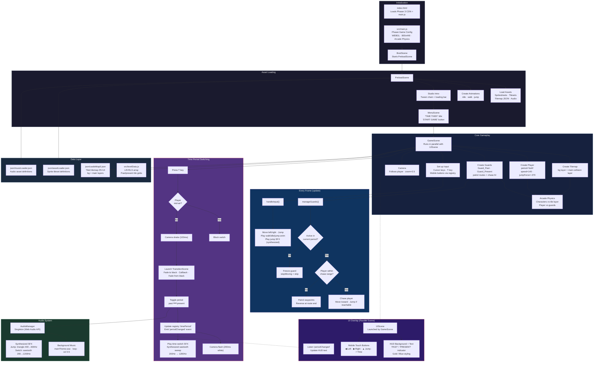

# Time Thief — Proof of Concept

A 2D platformer with a time-travel mechanic where the player switches between past and present to navigate levels and avoid guards.

**Team:** Ernie Jennison, Waheed Khan, Evangel Hightower-Rojas, Serena Heath, Joshua Peterson

**Engine:** Phaser 3 with Arcade Physics

---

## Architecture

Class diagram of every custom class and its relationship to Phaser-provided ancestors.

> **Legend — method markers**
> Methods marked `[override]` are Phaser lifecycle methods that this class overrides.
> All other methods are new additions defined by the team.

```mermaid
classDiagram
    %% ─── Phaser base classes ────────────────────────────────────────────────
    class PhaserScene["Phaser.Scene"] {
        <<Phaser>>
        +init(data)
        +preload()
        +create()
        +update()
    }

    class PhaserArcadeSprite["Phaser.Physics.Arcade.Sprite"] {
        <<Phaser>>
    }

    %% ─── Audio system ────────────────────────────────────────────────────────
    class AudioManager {
        +masterVolume : number
        -ctx : AudioContext
        -bgMusic : Sound
        -musicPlaying : boolean
        +constructor(scene)
        +init()
        +resume()
        +setVolume(vol)
        +playTone(freq, duration, type, volume)
        +playJump()
        +playHit()
        +playCaught()
        +playWin()
        +playTimeSwitch()
        +startMusic()
        +playMusicLoop()
        +stopMusic()
    }

    %% ─── Game-object hierarchy ───────────────────────────────────────────────
    class GameObject {
        +period : string
        +objectType : string
        +persistentState : Object
        +constructor(scene, x, y, texture, config)
        +onPeriodChange(newPeriod)
        +isActiveInPeriod(period) bool
    }

    class Player {
        +speed : number
        +jumpForce : number
        +constructor(scene, x, y)
        +moveLeft()
        +moveRight()
        +stopMoving()
        +jump() bool
        +isMidAir$ bool
    }

    class Guard_Generic {
        +speed : number
        +jumpForce : number
        +verticalReach : number
        +chaseRange : Ellipse
        +patroling : boolean
        +cooldownTimer : TimerEvent
        +constructor(scene, x, y, visionSize, patrolRoute, timePeriod, texture)
        +moveLeft()
        +moveRight()
        +stopMoving()
        +jump() bool
        +isMidAir$ bool
        +chase(target)
        +setPatrolRoute(route)
        +patrol()
        +fixVisionRing()
    }

    class Guard_Present {
        +constructor(scene, x, y, visionLength, patrolRoute)
    }

    class Guard_Past {
        +constructor(scene, x, y, visionLength, patrolRoute)
    }

    %% ─── Scene hierarchy ─────────────────────────────────────────────────────
    class BootScene {
        +constructor() [override]
        +create() [override]
    }

    class PreloadScene {
        +constructor() [override]
        +preload() [override]
        +create() [override]
    }

    class MenuScene {
        +constructor() [override]
        +create() [override]
        +createMenuButton(x, y, label, callback)
    }

    class GameScene {
        +timePeriod : string
        +player : Player
        +guards : Guard_Generic[]
        +lives : number
        +caught : boolean
        +won : boolean
        +constructor() [override]
        +create() [override]
        +update() [override]
        +createPlayer()
        +createObjective()
        +createGuard(GuardClass, x, y, patrolRoute, visionSize)
        +setupCollisions()
        +setupKeyboardInput()
        +updatePeriodVisuals(period)
        +playerHit(guard)
        +triggerGameOver()
        +playerWon()
        +showOverlay(title, color, hint, onAction)
        +switchTimePeriod()
        +handleInput()
        +manageGuards()
    }

    class TutorialScene {
        +timePeriod : string
        +player : Player
        +constructor() [override]
        +create() [override]
        +update() [override]
        +createPlayer()
        +setupCollisions()
        +setupKeyboardInput()
        +updatePeriodVisuals(period)
        +switchTimePeriod()
        +handleInput()
    }

    class UIScene {
        +constructor() [override]
        +preload() [override]
        +create() [override]
        +createHUD(caller)
        +updateHUD(period)
        +createLivesDisplay()
        +drawLives(count)
        +createMenuButton(x, y)
        +createButton(x, y, action, texture, scale)
    }

    class TransitionScene {
        +constructor() [override]
        +create(data) [override]
    }

    class SettingsScene {
        +callerKey : string
        +constructor() [override]
        +init(data) [override]
        +create() [override]
        +close()
        +createVolumeSlider(cx, cy)
        +createButton(x, y, label, bgHex, textColor, callback)
    }

    %% ─── Inheritance relationships ───────────────────────────────────────────
    PhaserArcadeSprite <|-- GameObject
    GameObject         <|-- Player
    GameObject         <|-- Guard_Generic
    Guard_Generic      <|-- Guard_Present
    Guard_Generic      <|-- Guard_Past

    PhaserScene <|-- BootScene
    PhaserScene <|-- PreloadScene
    PhaserScene <|-- MenuScene
    PhaserScene <|-- GameScene
    PhaserScene <|-- TutorialScene
    PhaserScene <|-- UIScene
    PhaserScene <|-- TransitionScene
    PhaserScene <|-- SettingsScene

    %% ─── Composition / usage ─────────────────────────────────────────────────
    PreloadScene  ..> AudioManager : creates
    GameScene     o-- Player       : owns
    GameScene     o-- Guard_Generic : owns
    TutorialScene o-- Player       : owns
```

---

## Requirements Coverage

### Audio

| Kind | Implementation | Location |
|---|---|---|
| **1. Continuously looping background sound** | `mainTheme.wav` loaded via Phaser's sound manager and looped at volume 0.5. Started when the player clicks "START GAME" on the menu. | `PreloadScene.js` (loads via `musicLoader.json`), `AudioManager.js` `startMusic()` |
| **3. Dynamically-generated sounds** | Synthesized via Web Audio API oscillators: a bubbly two-tone triangle-wave jump SFX (400 Hz → 600 Hz) and a sawtooth frequency-sweep time-switch SFX (200 Hz → 1200 Hz) with custom attack/decay envelopes. A programmatic 4-bar sine-wave music loop (C4–E4–G4–A4) also serves as a fallback. | `AudioManager.js` `playJumpSound()`, `playSwitchSound()`, `playMusicLoop()` |

### Visual

| Kind | Implementation | Location |
|---|---|---|
| **1. Image-based assets (sprites & tilesets)** | Player spritesheet (`mcSpriteSheet.png`, 20×32 px, 9 frames for idle/walk/jump) and a 7-tile tileset (`levelTileset0.png`, 16×16 px each). | Loaded via `assetLoader.json` in `PreloadScene.js` |
| **2. Non-image asset (tilemap)** | Level layout authored in Tiled (`castleMap0.json`, 25×14 grid, two layers `bg`/`main`) with tileset references, rendered via Phaser's tilemap system. | `GameScene.js` `create()` |
| **3. Procedurally-defined vector graphics** | Loading bar (filled rect), HUD period indicator, mobile touch buttons with rounded rects and strokes, transition fade overlay, and guard debug vision rings (circle, 0xfeed4f, 25% alpha) — all drawn via `Phaser.GameObjects.Graphics`. | `PreloadScene.js`, `UIScene.js`, `TransitionScene.js`, `Guards.js` |

### Motion

Smooth motion appears throughout the core mechanic:

- **Player movement** — velocity-based horizontal movement (`speed: 140`) and jumping with gravity (`jumpForce: -370`) via Arcade Physics, updated every frame in `GameScene.handleInput()`.
- **Guard AI chasing** — guards detect the player within a configurable `Phaser.Geom.Ellipse` chase range and move toward them at `speed: 180`, with the ability to jump to reach targets within `verticalReach`.
- **Guard patrol** — waypoint-based patrolling between defined route points, reversing direction when all waypoints are reached.
- **Tweened transitions** — studio logo scale/color/fade chain in PreloadScene (`tweens.chain()`), fade-to-black/fade-from-black for time travel (`tweens.addCounter()`), and camera shake + flash effects on period switch.

### Progression

The prototype establishes a data-driven level progression system:

- **Multi-level infrastructure** — `src/levelData.js` exports an array `LEVELS` where each entry defines a level ID, name, player start position, and separate tile grids for past and present periods. Currently one level ("PoC Level") is populated; additional levels can be added by appending to this array.
- **Persistent state** — every `GameObject` carries a `persistentState` property intended to track changes that survive across time-period switches (e.g., objects moved in the past affecting the present).
- **Planned difficulty scaling** — future levels would introduce more complex guard patrol routes, tighter platforming, and additional guard types, with progression gated by completing earlier levels.

### Prefabs

| Kind | Implementation | Location |
|---|---|---|
| **1. GameObject subclass hierarchy** | `GameObject` (extends `Phaser.Physics.Arcade.Sprite`) → `Player`, `Guard_Generic` → `Guard_Past`, `Guard_Present`. The base class provides period-awareness (visibility + physics toggling), shared movement methods, and `persistentState`. | `src/objects/GameObject.js`, `Player.js`, `Guards.js` |
| **3. Design presets in program code** | `src/levelData.js` contains a JSON-structured array of level configs with player start coordinates and per-period 25×14 tile grids, all defined inline as JavaScript objects. | `src/levelData.js` |
| **4. Design presets in data files** | External JSON files decouple asset configuration from code: `assetLoader.json` (sprite sheet definitions), `musicLoader.json` (audio asset paths), `castleMap0.json` (Tiled tilemap with two layers), and `castle0.json` / `castleTileset.json` (tileset metadata). | `json/` |
